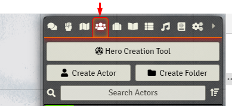
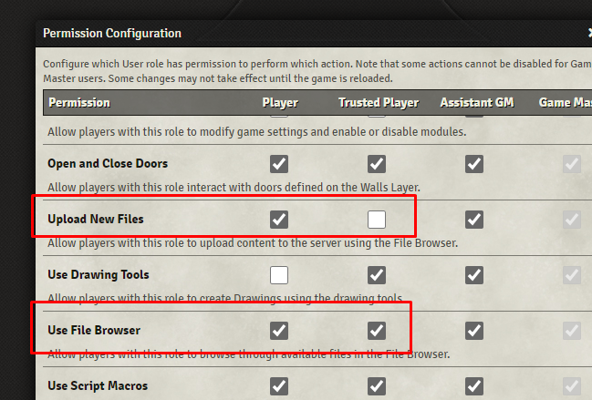
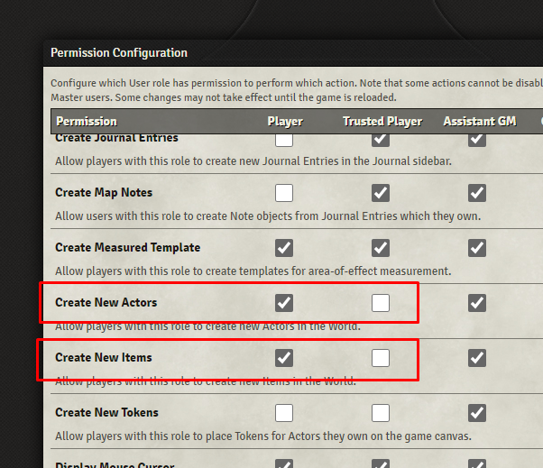

# Hero Creation Tool for Foundry VTT - DnD 5e

* **[Setup](#setup)**

* **[The Tool](#the-tool)**

* **[Limitations](#limitations)**

* **[FAQ](#faq)**

* **[Report a bug](#report-a-bug)**

* **[How-To for DMs](https://github.com/HeroCreationLab/hero-creation-tool/blob/main/docs/HOW-TO.md)**

* **[Changelog](https://github.com/HeroCreationLab/hero-creation-tool/blob/main/docs/CHANGELOG.md)**

* **[Setup for collaborators](https://github.com/HeroCreationLab/hero-creation-tool/blob/main/docs/DEV-SETUP.md)**

* **[License](https://github.com/HeroCreationLab/hero-creation-tool/blob/main/docs/LICENSE)**

## Setup

The tool can be installed like a regular module, so you can log out of your world, go to Modules > Install Modules and look for it by name.

## The Tool

After installing the module, you will find a new button on top of your Actors' Directory. Clicking it will start the tool, and if it's not simple enough from there, we failed!

## Limitations

Sadly, in every approach there's pros and cons. The priority for the module has always been facilitating both the Players and the DMs work, allowing DMs to easily define new races, clases, features, spells, you name it, and for players to have a streamlined, yet flexible and customizable character creation experience.

To support the first point, and with the goal of integrating as seemlessly as possible with any content that adds compendiums with character creation elements, the module restricts itself to only data values available in Foundry's DnD5e vanilla entities by default: Classes, Spells, and anything else as Features.

This makes it that you can easily make a new custom class and define its skill proficiencies or spellcasting ability, for example, but renders a custom race into little more than an a name, an icon and a description. The module tries to brute-force as much as it can, finding for example Subraces and Racial features by the parent class name, but other than finding the item to show it on the creator, and adding it to the character, it can't really automate much else like Ability Score Improvements, proficiencies (others than the mentioned Class Skill Proficiencies) and long etc.

As Foundry types evolve, the module will strive to keep up with those changes and enhance the experience as much as possible.

## FAQ

* ### Why clicking on the avatar/token or the buttons do nothing / cause an error message  ?

DMs shouldn't experience this, but if you are a player, ask your DM to give you permission to *Upload New Files* and *Use File Browser*.

* ### Why clicking on Submit does nothing / causes an error message ?

Likewise, DMs shouldn't experience this, but if you are a player, ask your DM to give you permission to *Create New Actors* and/or *Create New Items*, depending on the error you are getting (safer to have both).

* ### Why ABC doesn't automatically add X, Y, and/or Z ?
Short Answer: Because we have no way of knowing for sure.

Long Answer: The module's philosophy is to make things as easy as possible for both DMs and Players. That means not only when using the tool for creating characters for your games, but also creating your own content for your campaigns and seemlessly integrating them into the tool. For that reason, the module opts to use the vanilla Foundry-supported item types. As an alternative, we could have provided an interface for loading items on JSON or something alike, but that would skew the tool making it less friendly for all the non-tech-savvy users.

The type of item defines certain characteristics of it, namely attributes you can set and save on the item. Sadly, there are currently not item types for every use case (and there might never be, we don't know), and those that exist (like Classes and Spells) have gaps here and there.

For example, a Class can define the saving throws the owner will have, and the number and eligible skill proficiencies, but has nothing about extra language, weapon, armor or tool proficiencies, alongside many other useful information when creating a character. Therefore, the solution is to help the user automating all we *know for sure*, and letting you pick everything else from all available options.

As the DnD5e system grows and evolves, and new information becomes available in existing data types, or new data types as a whole become available, the module will be updated to keep up with them.

* ### Why doesn't X class have Y starting gold instead of that pesky default ?
On a similar vein to the point above, the short answer is that we don't know. Longer answer is that starting gold per class is a PHB content, something we don't have available on the SRD, so there's legalize stuff involved. For this reason, it is also unlikely that Foundry *Class*-items will ever have an Starting Gold attribute somewhere.

There are some starting gold values on the Basic Rules, but they don't cover all the cases, won't cover custom classes because of the *Class*-item detail mentioned before, and using them is some grey area on the legalize we don't want to be involved, just in case. So, default for everyone, and customize it as you see fit on your own.

* ### How do I add my own races/classes/...
If you are a player -> Ask your DM to set those up, and/or help them setting them up.

If you are a DM / Helping hand -> Please, refer to the [HOW-TO](https://github.com/HeroCreationLab/hero-creation-tool/blob/main/docs/HOW-TO.md).

## Report a bug

The module integrates [Bug Reporter](https://foundryvtt.com/packages/bug-reporter) and is the preferred way of submitting bugs directly from inside your game, as it can easily include module settings and active modules.

For any other issues, requests and bug reporting, you can visit the project's [Github](https://github.com/HeroCreationLab/hero-creation-tool/issues).