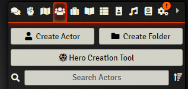

# Hero Creation Tool for Foundry VTT - DnD 5e


[](https://ko-fi.com/N4N88281M)


* **[Setup](#setup)**

* **[The Tool](#the-tool)**

* **[Limitations](#limitations)**

* **[Wiki](https://github.com/HeroCreationLab/hero-creation-tool/wiki)**

* **[FAQ](https://github.com/HeroCreationLab/hero-creation-tool/wiki/FAQ)**

* **[Report a bug](#report-a-bug)**

* **[Changelog](https://github.com/HeroCreationLab/hero-creation-tool/blob/main/docs/CHANGELOG.md)**

* **[Setup for collaborators](https://github.com/HeroCreationLab/hero-creation-tool/blob/main/docs/DEV-SETUP.md)**

* **[Collaborations](#collaborations)**

* **[License](https://github.com/HeroCreationLab/hero-creation-tool/blob/main/docs/LICENSE)**

## Setup

The module can be installed from the administrator's menu as usual. If you somehow need the url for the manifest, you can install the module with the following link:

```https://github.com/HeroCreationLab/hero-creation-tool/releases/latest/download/module.json```

## The Tool

After installing and enabling the module, you will find a new button on top of your Actors' menu. (You can move this button into the Create New Actor window if you want, through a module setting)

Clicking it will start the tool, and if it's not simple enough from there, we failed!

 

We also provide a public API, you can check the wiki for details.

## Limitations

The module strives to support both SRD-provided and custom content alike, with 0 need of playing around with JSONs or any sort of programmatic configuration: everything can be done inside FoundryVTT. For how items need to be for maximum compatibility, we therefore always try to make the tool work with the provided SRD items; if you make your own custom items, please ensure they follow the same conventions (the [module wiki](https://github.com/HeroCreationLab/hero-creation-tool/wiki) explains how to make custom items of every type that look like SRD ones and work with the tool).

Sadly, not everything one would want or need for a complete end-to-end character creation on 5e is available yet be it on the core software or the 5e system, so some things are left open for the user to input. As the 5e system has evolved since the release of this module, we will adjust to it 

## Report a bug

The module integrates [Bug Reporter](https://foundryvtt.com/packages/bug-reporter) and is the preferred way of submitting bugs directly from inside your game, as it can easily include module settings and active modules.

For any other issues, requests and bug reporting, you can visit the project's [Github](https://github.com/HeroCreationLab/hero-creation-tool/issues).

## Collaborations

I wanted to make special mentions to:

* MrPrimate for his assistance with the Tokenizer integration and his help aligning some details from DDBImporter to fit the module expectations.
* Ghost for his unending help with.. absolutely everything!
* @Padhiver for providing the french translation.
* touge and BrotherSharper for providing the japanese translation.